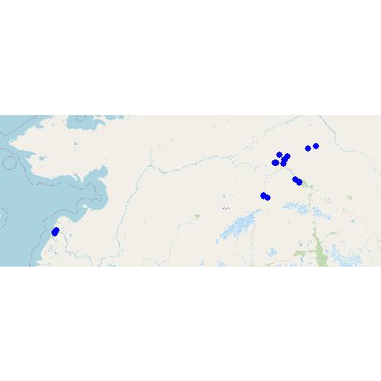

```{r setup, include=FALSE}
knitr::opts_chunk$set(echo = TRUE)
source("./Functions/lecospectR.R")
require(maptiles)
require(terra)
```
## Laboratory of Ecological Spectroscopy (lecospec)
The purpose lecospec code is to take ground or image based reflectance spectra, build a classifier or regression,
apply that model to an imaging spectrometer data cube (aka hyperspectral image). 

## How to run lecospec 
### NOTE: Your data will need to be a spectral library with all files per site in a directory
### File naming structure etc. maybe different and therefore cleaning of scans below is for demonstration only.

1) First, install dependencies 
/Scripts/install_dependencies.R
2) Then source the package of lecospectR 
/Functions/lecospectR.R
3) Our workflow assumes a list of species with associated levels of taxonomic information (eg. functional group membership) 
/Data/SpeciesTable_20220125.csv
4) Build a spectral library from a range of field scans collected with Tungsten halogen illumination using a leaf clip or contact probe. 
These scripts delete bad scans and standardize the associated information into a single metadata format. Around 90 vegetation indices are 
also calculated and the narrow band reflectance is resampled and smoothed to 5 nm bands.
/Scripts/2_DataMunging.R                                     
/Scripts/2B_DataMunging_missing_spectra.R   
/Scripts/3_Create_SpecLibPSR.R
5) Collect spectra from pixels in images from UAV in quadrats and patches of plant functional types visible in ground reference or higher 
resolution RGB imagery. Calculate vegetation indices, smooth and resample spectra to 5 nm wide bands.
/Scripts/101_Crop_Training_PFT_vector.R                        
/Scripts/101_Crop_Training_Quads.R                             
/Scripts/102_Parse_training_PFT_vector_spectra.R              
/Scripts/103_Clean_training_PFT_vector_spectra.R              
/Scripts/104_Calculate_Vegindices_Image_Spectra.R              
er cleaning scans, the reflectance data can be summarized and visualized in various ways. Below is accuracy
summary of the median and interquartile ranges of reflectance (75% black & 95% grey) with the sample size in 
number of scans distributed across a number of scans (ground measured) or pixels (airborne).


```{r}

```

## Study Area and Data locations
The centers of all UAV flights and points where ground scans were collected are shown in the map.
```{r, echo=FALSE}
SpecLib_LatLong_point<-readOGR("./Output/Ground_Spetra_AK_points.kml") 
UAS_all_centroids<-readOGR("./Output/UAV_VNIR_AK_centroids.kml") 

bg <- get_tiles(ext(SpecLib_LatLong_point))
plotRGB(bg)
points(UAS_all_centroids, col="blue", lwd=10)
points(SpecLib_LatLong_point, col="red", lwd=3)

```


## 
1) validation_def.R sets all the input, output and needed associated files for building models and predicting images
2) Scripts/modelbuilding.ipynb Builds and visualizes model accuracy
3) Pick and model and explore results with lecospectR::validate_model.R , whicih calls the input data, models and settings from validate_def.R


