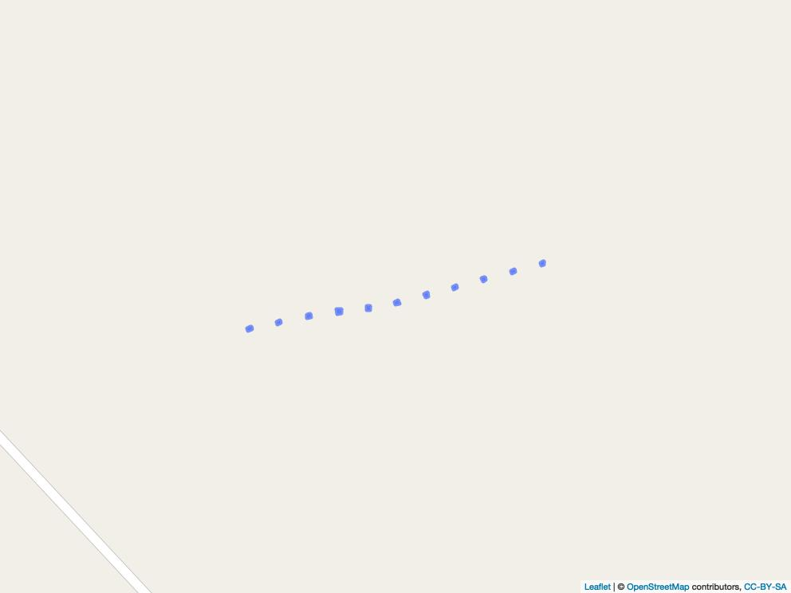

```{r setup, include=FALSE}
knitr::opts_chunk$set(echo = FALSE)
source("./Functions/lecospectR.R")
require(maptiles)
require(terra)
require(sf)
library(rgdal)
library(tidyverse)
library(sf)
require(stars)
```
## Laboratory of Ecological Spectroscopy (lecospec)
The purpose lecospec code is to take ground or image based reflectance spectra, build a classifier or regression,
apply that model to an imaging spectrometer data cube (aka hyperspectral image). 

1) First, install dependencies 
/Scripts/install_dependencies.R
2) Then source the package of lecospectR 
/Functions/lecospectR.R

The functions in lecospectR are divided into sections, all of which are loaded by sourcing /Functions/lecospectR.R

    dataframe_operations.R  
    model_support.R 
    pfts.R  
    pipeline.R  
    raster_operations.R 
    spectral_operations.R   
    training_utilities.R    
    type_conversion.R   
    utilities.R 
    validation.R    


#### How to run lecospec 

1) Our workflow assumes a list of species with associated levels of taxonomic information (eg. functional group membership) 
/Data/SpeciesTable_20220125.csv. This table is used for several steps, including aggregating validation to the same taxonomic level as training data.
2) Build a spectral library from a range of field scans collected with Tungsten halogen illumination using a leaf clip or contact probe. 
These scripts delete bad scans and standardize the associated information into a single metadata format. Around 90 vegetation indices are 
also calculated and the narrow band reflectance is resampled and smoothed to 5 nm bands.

    /Scripts/2_DataMunging.R
    /Scripts/2B_DataMunging_missing_spectra.R   
    /Scripts/3_Create_SpecLibPSR.R

The output of running these scripts are two spectral libraries, one of reflectance and one of vegetation indices along with the metadata for these reflectance 
measurements.

    /Output/C_001_SC3_Cleaned_SpectralLib.csv
    /Data/D_002_SpecLib_Derivs.csv

3) Collect spectra from pixels in images from UAV in quadrats and patches of plant functional types visible in ground reference or higher 
resolution RGB imagery. Calculate vegetation indices, smooth and resample spectra to 5 nm wide bands. Reflectance spectra are extracted from 
hand digitized patches of plant functional types provided as a shapefile to the first script (101_Crop_Training_PFT_vector). The same operation is 
performed in the second script (101_Crop_Training_Quads) for hand digitzed quadrats of validation ground cover data.
Script 102_Parse_training_PFT_vector_spectra adds metadata to each pixel by plant patch. 

    /Scripts/101_Crop_Training_PFT_vector.R                        
    /Scripts/101_Crop_Training_Quads.R                             
    /Scripts/102_Parse_training_PFT_vector_spectra.R              
    /Scripts/103_Clean_training_PFT_vector_spectra.R              
    /Scripts/104_Calculate_Vegindices_Image_Spectra.R              

After running these scripts, the outputs include the relectance and vegetation indices for each pixel from the patches of plants digitized from images.

    /Data/D_002_Image_SpecLib_Derivs.csv
    /Data/Ground_Validation/PFT_Image_spectra/PFT_Image_SpectralLib_Clean.csv

After cleaning scans, the reflectance data can be summarized and visualized in various ways. Below is accuracy
summary of the median and interquartile ranges of reflectance (75% black & 95% grey) with the sample size in 
number of scans distributed across a number of scans (ground measured) or pixels (airborne).


## Study Area and Data locations
The centers of all UAV flights and points where ground scans were collected are shown in the map.
Collecting these locations from the metadata and image centers for data collected as the Arctic boreal plant mapping use case for lecospectR using the 
Scripts/7_Visualizations_Ground_and_UAS_Spectra_locations.R which produces the two .kml files plotted in the map below.
```{r, echo=FALSE, include=FALSE}
SpecLib_LatLong_point<-readOGR("./Output/Ground_Spetra_AK_points.kml") 
UAS_all_centroids<-readOGR("./Output/UAV_VNIR_AK_centroids.kml") 

bg <- get_tiles(ext(SpecLib_LatLong_point))
plotRGB(bg)
points(UAS_all_centroids, col="blue", lwd=10)
points(SpecLib_LatLong_point, col="red", lwd=3)

```


## Model training and validation
1) validation_def.R sets all the input, output and needed associated files for building models and predicting images
In this script, The test_paths are set to the output of Script 101_Crop_Training_PFT_vector, which are a set of images with 326 bands from 400-1000nm covering only
the square quadrats 1m x 1m that were hand digitized in different study areas. Model paths are set for different types to be evaluated. The vector layers of each hand digitized
quadrats are set in tihe shape_paths. The names of each quadrat are listed manually to standardize across all since each vector layer of quadrats follow different order and have slightly 
different names.The validation_path are the ground cover estimates by quadrat derived from ground photos by a single expert observer. 

```{r, echo=FALSE, include=FALSE}
require(leaflet)
require(mapview)
EightmileQuads<-readOGR("Data/Vectors/EightMile_Quadrats_revised.shp")
#BisonExtent <- get_tiles(ext(BisonQuads))
#plot(BisonQuads)
#lines(BisonQuads, col="blue", lwd=10)
EightmileMap<-leaflet(EightmileQuads) %>%
    #leaflet::addTiles("https://server.arcgisonline.com/ArcGIS/rest/services/World_Imagery/MapServer/tile/{z}/{y}/{x}",
    #  options = providerTileOptions(minZoom = 1, maxZoom = 100)
    #) %>%
    leaflet::addTiles() %>%
    leaflet::addPolygons(data=EightmileQuads)

mapshot(EightmileMap, file = "Output/Prediction/EightmileQuads.jpeg")


```



2) Builds and visualizes model accuracy 

    /Scripts/modelbuilding.ipynb 

3) Pick and model and explore results with lecospectR::validate_model.R , whicih calls the input data, models and settings from validate_def.R
mle/

4) Generate predidctions for plant functional type occurence for whole datacubes by running the parallelized estimate_landcover function from lecospectR. Set the number of tiles carefully
based on RAM and image size. To run the function lecospectR::estimate_landcover, check the settings in the /config.json. The settings include 
    
    automatic_tiling: false   
    max_size: 200    
    x_tiles: 2 # Set to make about 10% of RAM size on machine     
    y_tiles: 2    
    tile_path: "./tiles/" #Intermediate products go here, like /temp. Will need to be cleaned out every so often    
    model_path: "./mle/"INSERT MOD NAME".rda" #Models built in /modelbuilding.ipynb can be pasted here  
    clusterCores: (NUM CORES ON MACHINE - 1) #Speeds up the processing on larger images to have more cores but tradeoff between handling tiles and creating tiles exists    
    parallelize_by_tiles: false 
    key_path: "./fg2key.json"   
    external_bands: "./bands.csv" #Bands used to rename spectral objects consistently along the way 
    output_format: "grd"    
    aggregation: 1 #Depends on levels within data and only relevant for taxonomic-like structured response categories   

Once the /config.json is set to match what is needed, the following script shows specifying a single large image and smaller images used in estimate_landcover.

    /Scripts/run.R 

5) Visualize maps of full image output showing plant functional types

    /Scripts/visualizeRasters.R
