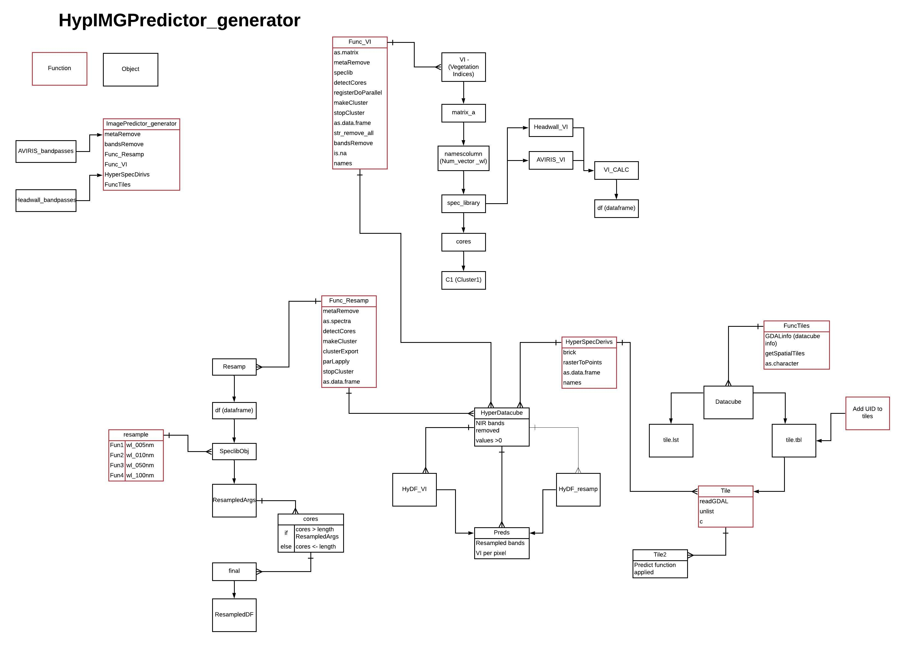

# Processing Headwall Hyperspectral Rasters using Tiling and Parallelization:  R (tutorial)

## Authors & Contributors 
*1. Dr. Peter Nelson*      
*2. Kevaughan Smith*  
*3. Jane Pettit*  
*4. Catherine Chan*  

## Contents

- [Introduction](#Introduction)
- [Preparing Spectral Libraries](#Preparing-Spectral-Libraries)
- [Building classification model](#Building-classification-model)
- [Classifying Hyperspectral Data](#Classifying-Hyperspectral-Data)
- [References](#References)
    
### Introduction
The electromagnetic spectrum is composed of thousands of bands representing different types of light energy. Imaging spectrometers (instruments that collect hyperspectral data) break the electromagnetic spectrum into groups of bands that support classification of objects by their spectral properties on the Earth's surface. Hyperspectral data consists of many bands - up to hundreds of bands - that cover the electromagnetic spectrum.  

The Headwall Micro A-series VINIR imaging spectrometer collects data within the 400 nm to 1000 nm portions of the electromagnetic spectrum within bands that are approximately 2 nm in width. This results in a hyperspectral data cube that contains approximately 326 bands. However (say something about noisey bands in the 900-100nm wavelength region)

This tutorial demonstrates how to use functions created by our team to read, process and create large spatial (Headwall raster) data sets. In principle, both examples follow the same systematic approach:
1. Preparing your spectral library from field spectroradiometers
2. Preparing your spectral library from digitized pixels
2. Building classification model 
3. Classifying Headwall Hyperspectral Images 

Packages used in this tutorial include:
```
library(spectrolab)
library(tidyverse)
library(raster)
library(SpaDES)
library(doParallel)
library(hsdar)
library(caret)
library(randomForest)
library(randomcoloR)
```

### Preparing Spectral Libraries

Spectral Libraries can be complied from:
1. Portable spectrometers
2. Digitizing pexels of known classes in your image

#### Preparing Spectral Libraries using PSR
The one used here was a (Spectral Evolution PSR+) which covers the full spectrum (350-2500 nm) and have 1nm wide bands. Note that the spectrtal range and width of the field spec exceeds that of the imaging sensor (400nm - 1000nm, 2nm wide bands). Hence, resampling these bandpasses to match the sensor bandpasses is essential.   

Lets take a look at our spectral library before we resample the bands to match our sensor (user would have already done some data munging) 
```
SpectralLibrary<- read.csv ("/data/SpectralLibrary_raw.csv")
str(SpectralLibrary)
```
Note that there are different classes types (class 1, class 2, class 3, class 4) and wavelengths across the full spectrum (350-2500 nm. However, we're intrested in one class (Class 2 = represents functional groups of plant species).  
Lets take a look at class 1
```
table(SpectralLibrary$Class1)
  CLASS             n
  Class1            1001
  class2            42
  class32           21
```
Note that there are a few functional groups with many observations. Lets use our function to:  
1. Remove reflectance values >2 or <0 
2. Resample the bandpasses so the they match that of the sensor
3. Make observations equal across all classes
4. Plots the median spectra for each class. 
``` 
SpecLibPSR<-SpectralLibrary_prep(filename = path/to/RawSpectralLibrary
                                  outfile = path/to/outputfolder)
  ```
  
THIS SHOULD BE A FACET PLOT SHOWING SPECTRAL FEATURES OF EACH CLASS OF INTEREST


### Preparing Spectral Libraries using didgitized Raster Pixels
SAMPLE CODE SHOULD  (Use a function that adds metadata, removes uncalibrated scans from spectral library,equalizes the number of observation per class and plots the median spectra for each class)
``` 
SpecLibHypIMG<-SpectralLibrary_prep(filename = path/to/shapefiles_of_didgitizedpolygons
                                outfile = path/to/outputfolder)
  ```

### Building classification model
SAMPLE CODE SHOULD (use a function to build a Build a classification model)
``` 
Classification_Model<-Spectral_Classifier(spectral_Library = path/to/SpectralLibrary,
                                          Out_file = path/to/outputfolder)
  ```
MODEL RESULTS
```
Call:
 randomForest(formula = Classes ~ ., data = newdf, mtry = sqrt(ncol(newdf)),      ntree = 1001, localImp = TRUE) 
               Type of random forest: classification
                     Number of trees: 1001
No. of variables tried at each split: 7

        OOB estimate of  error rate: 25.69%
```  
CONFUSION MATRIX 
```
                 Abiotic_Litter Abiotic_Rock Abiotic_Soil Dwarf_Shrub_Broad Dwarf_Shrub_Needle Forb Graminoid_Grass
Abiotic_Litter                  4            0            0                 0                  1    0               0
Abiotic_Rock                    1           13            5                 0                  0    0               0
Abiotic_Soil                    0            5            2                 0                  0    0               0
Dwarf_Shrub_Broad               0            0            0                79                  0    3               0
Dwarf_Shrub_Needle              0            0            0                 4                 13    0               0
Forb                            0            0            0                 1                  0   28               0
Graminoid_Grass                 0            0            0                 0                  0    0               3
Graminoid_Sedge                 0            0            0                 1                  0    1               0
Lichen_Dark                     0            0            0                 4                  0    2               0
Lichen_Light                    0            0            0                 0                  0    2               0
Lichen_Yellow                   0            0            0                 1                  0    0               0
Moss_Acrocarp                   0            0            0                 0                  2    0               0
Moss_Pleurocarp                 0            0            0                 0                  0    0               0
Moss_Sphagnum                   0            0            0                 0                  0    0               0
```

### Classifying Hyperspectral Data
SAMPLE CODE (use a function to created a predicted layer of a datacube)
```
PredictedRaster_Layer<-HyperspecImageClassifier(filename = Path/to/datacube.envi,
                                                spectral_Library = path/to/SpectralLibrary.csv,
                                                Out_file = path/to/outputfile)
  ```

IMAGE OF DATACUBE 
```
plot(PredictedRaster_Layer)
```


### HypIMGPredictor_generator Entity relationship diagram
JANE'S ERDS (IMAGE HERE)


### References


