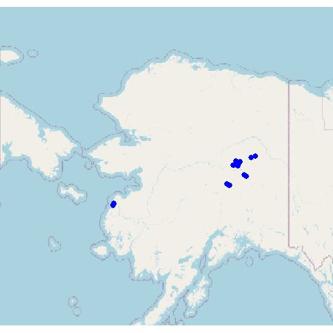

Lecospec
================

## Laboratory of Ecological Spectroscopy (lecospec)

The purpose lecospec code is to take ground or image based reflectance
spectra, build a classifier or regression, apply that model to an
imaging spectrometer data cube (aka hyperspectral image).

1)  First, install dependencies /Scripts/install\_dependencies.R
2)  Then source the package of lecospectR /Functions/lecospectR.R

The functions in lecospectR are divided into sections, all of which are
loaded by sourcing /Functions/lecospectR.R

``` 
/Functions/dataframe_operations.R  
/Functions/model_support.R 
/Functions/pfts.R  
/Functions/pipeline.R  
/Functions/raster_operations.R 
/Functions/spectral_operations.R   
/Functions/training_utilities.R    
/Functions/type_conversion.R   
/Functions/utilities.R 
/Functions/validation.R    
```

## How to run lecospec

1)  Our workflow assumes a list of species with associated levels of
    taxonomic information (eg. functional group membership)
    /Data/SpeciesTable\_20220125.csv. This table is used for several
    steps, including aggregating validation to the same taxonomic level
    as training data.

2)  Build a spectral library from a range of field scans collected with
    Tungsten halogen illumination using a leaf clip or contact probe.
    These scripts delete bad scans and standardize the associated
    information into a single metadata format. Around 90 vegetation
    indices are also calculated and the narrow band reflectance is
    resampled and smoothed to 5 nm bands.
    
    /Scripts/2\_DataMunging.R  
    /Scripts/2B\_DataMunging\_missing\_spectra.R  
    /Scripts/3\_Create\_SpecLibPSR.R

The output of running these scripts are two spectral libraries, one of
reflectance and one of vegetation indices along with the metadata for
these reflectance measurements.

``` 
/Output/C_001_SC3_Cleaned_SpectralLib.csv   
/Data/D_002_SpecLib_Derivs.csv  
```

3)  Collect spectra from pixels in images from UAV in quadrats and
    patches of plant functional types visible in ground reference or
    higher resolution RGB imagery. Calculate vegetation indices, smooth
    and resample spectra to 5 nm wide bands. Reflectance spectra are
    extracted from hand digitized patches of plant functional types
    provided as a shapefile to the first script
    (101\_Crop\_Training\_PFT\_vector). The same operation is performed
    in the second script (101\_Crop\_Training\_Quads) for hand digitzed
    quadrats of validation ground cover data. Script
    102\_Parse\_training\_PFT\_vector\_spectra adds metadata to each
    pixel by plant patch.
    
    /Scripts/101\_Crop\_Training\_PFT\_vector.R  
    /Scripts/101\_Crop\_Training\_Quads.R  
    /Scripts/102\_Parse\_training\_PFT\_vector\_spectra.R  
    /Scripts/103\_Clean\_training\_PFT\_vector\_spectra.R  
    /Scripts/104\_Calculate\_Vegindices\_Image\_Spectra.R

After running these scripts, the outputs include the relectance and
vegetation indices for each pixel from the patches of plants digitized
from images.

``` 
/Data/D_002_Image_SpecLib_Derivs.csv    
/Data/Ground_Validation/PFT_Image_spectra/PFT_Image_SpectralLib_Clean.csv   
```

After cleaning scans, the reflectance data can be summarized and
visualized in various ways. Below is accuracy summary of the median and
interquartile ranges of reflectance (75% black & 95% grey) with the
sample size in number of scans distributed across a number of scans
(ground measured) or pixels (airborne).


## Study Area and Data locations

The centers of all UAV flights and points where ground scans were
collected are shown in the map. Collecting these locations from the
metadata and image centers for data collected as the Arctic boreal plant
mapping use case for lecospectR using the
Scripts/7\_Visualizations\_Ground\_and\_UAS\_Spectra\_locations.R which
produces the two .kml files plotted in the map below. The image below it
shows one site (Bison Gulch near Denali National Park) with ground
validation quadrat locations (squares) along 100 m long transect with a
white calibration tarp on one end.



## Model training and validation

1)  Set all the input, output and needed associated files for building
    models and predicting images
    
    /validation\_def.R

In this script, The test\_paths are set to the output of Script
101\_Crop\_Training\_PFT\_vector, which are a set of images with 326
bands from 400-1000nm covering only the square quadrats 1m x 1m that
were hand digitized in different study areas. Model paths are set for
different types to be evaluated. The vector layers of each hand
digitized quadrats are set in tihe shape\_paths. The names of each
quadrat are listed manually to standardize across all since each vector
layer of quadrats follow different order and have slightly different
names. The validation\_path are the ground cover estimates by quadrat
derived from ground photos by a single expert observer.

2)  Builds and visualizes model accuracy
    
    /Scripts/modelbuilding.ipynb

This R notebook (requires JupyterNotebook and Python to run) builds
models of plant functional types as a function of reflectance spectra
separately for ground and image based models. The blocks step through
tranformation of the ground and image based reflectance spectra through
removal of NAs, imputing missing values, normalization and
ground-to-image instrument correction.

Here is an example confusion matrix from a model showing
misclassification between plant funcational types.


3)  After exploring models based on different input data, Pick and model
    and explore results with lecospectR::validate\_model.R , whicih
    calls the input data, models and settings from validate\_def.R
    
    /mle/“MODEL UUID HERE”

4)  Generate predidctions for plant functional type occurence for whole
    datacubes by running the parallelized estimate\_landcover function
    from lecospectR. Set the number of tiles carefully based on RAM and
    image size. To run the function lecospectR::estimate\_landcover,
    check the settings in the /config.json. The settings include
    
    automatic\_tiling: false  
    max\_size: 200  
    x\_tiles: 2 \# Set to make about 10% of RAM size on machine  
    y\_tiles: 2  
    tile\_path: “./tiles/” \#Intermediate products go here, like /temp.
    Will need to be cleaned out every so often  
    model\_path: “./mle/”INSERT MOD NAME“.rda” \#Models built in
    /modelbuilding.ipynb can be pasted here  
    clusterCores: (NUM CORES ON MACHINE - 1) \#Speeds up the processing
    on larger images to have more cores but tradeoff between handling
    tiles and creating tiles exists  
    parallelize\_by\_tiles: false key\_path: “./fg2key.json”  
    external\_bands: “./bands.csv” \#Bands used to rename spectral
    objects consistently along the way output\_format: “grd”  
    aggregation: 1 \#Depends on levels within data and only relevant for
    taxonomic-like structured response categories

Once the /config.json is set to match what is needed, the following
script shows specifying a single large image and smaller images used in
estimate\_landcover.

``` 
/Scripts/run.R   
```

5)  Visualize maps of full image output showing plant functional types
    
    /Scripts/visualizeRasters.R

Example predicted plant functional type map from one site (Bison Gulch
near Denali National Park)

