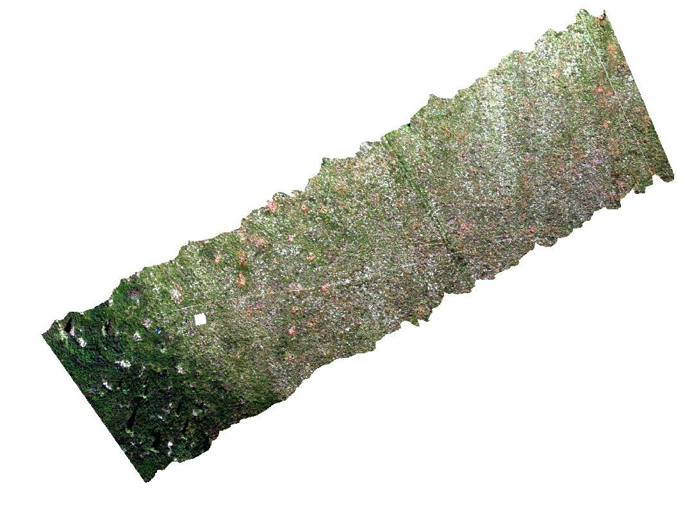

```{r setup, include=FALSE}
knitr::opts_chunk$set(echo = TRUE)
```

## GitHub Documents

This is an R Markdown format used for publishing markdown documents to GitHub. When you click the **Knit** button all R code chunks are run and a markdown file (.md) suitable for publishing to GitHub is generated.

## Including Code

You can include R code in the document as follows:

```{r cars}
summary(cars)
```

## Including Plots

You can also embed plots, for example:

```{r pressure, echo=FALSE}
plot(pressure)
```

Note that the `echo = FALSE` parameter was added to the code chunk to prevent printing of the R code that generated the plot.


# LECOSPEC

## Authors & Contributors 
*1. Dr. Peter Nelson*      
*2. Kevaughan S Smith*  
*3. Jane Pettit*  
*4. Catherine Chan*  

## Contents

- [Introduction](#Introduction)
- [Approaches to fine-scale image classification](#Approaches-to-fine-scale-image-classification)
- [Building classification model](#Building-classification-model)
- [Classifying Hyperspectral Data](#Classifying-Hyperspectral-Data)
- [References](#References)
    
### Introduction
The Laboratory of Ecological Spectroscopy (LEcoSpec or lecospec) is a set of functions in R that use reflectance spectra of targets in the visible and near-infrared range to estimate the presence or amount of those plants in images collected with imaging spectrometers (instruments that collect hyperspectral data). LEcoSpec operates a Headwall Micro A-series VINIR imaging spectrometer that collects reflectance measurements between the 400 nm to 1000 nm in the electromagnetic spectrum within bands that are approximately 2 nm in width. This results in a "hyperspectral"" data cube that contains approximately 326 bands. LEcoSpec can also process other types of imaging spectrometer data, such as NASA's G-LiHT and AVIRIS ng sensors, with a little modification.

This tutorial demonstrates how to use functions created by our team to read, process and create large spatial (Headwall raster) data sets. In principle, both examples follow the same systematic approach:
1. Preparing your spectral library from field spectroradiometers
2. Preparing your spectral library from digitized pixels
2. Building classification model 
3. Classifying Headwall Hyperspectral Images 

*Click [here](https://drive.google.com/drive/u/2/folders/1HIgyxhXO0kYDXYohvymxGupc2yR0k1-4) to download the data and output folder to the repository after cloning:*

Packages used in this tutorial include:
```{r}
knitr::opts_chunk$set(echo = FALSE)

require(devtools)
require(tidyverse)
require(raster)
require(SpaDES)
require(doParallel)
require(parallel)
require(hsdar)
require(caret)
require(ranger)
require(tools)
require(randomForest)
```

```
When prompted to update packages, after running install_github("spectrolab", Please select none by entering 3 in the console window and clicking enter on your key board

### Approaches to fine-scale image classification
Ground truthed data for image classification can be collected using:
1. Portable Field spectrometers
2. Digitizing pixels of known classes in your image

#### The Portable Field Spectrometer Approach
The one used here was a (Spectral Evolution PSR+) which covers the full spectrum (350-2500 nm) and have 1nm wide bands. Note that the spectrtal range and width of this field spec exceeds that of the imaging sensor (400nm - 1000nm, 2nm wide bands). Hence, resampling these bandpasses to match the sensor bandpasses is essential.  

Lets take a look at our spectral library before we resample the bands to match our sensor (user would have already done some data munging).

```
# Note that this is a spectral object
```{r}
list.dirs()
SpectralLibrary<-readRDS("./Output/C_004_SpecLib_FunctionalGroupsEqual_DF.rds")
str(SpectralLibrary)

```  
Note that we have a total of 748 samples. We can convert to a dataframe and look at its features.
```{r}
SpectralLibrary<-SpectralLibrary%>%
                    as.data.frame()%>%
                    dplyr::select(-sample_name)
str(SpectralLibrary)
```    

Note that there are different classes types (class 1, class 2, class 3, class 4) and wavelengths across the full spectrum (350-2500 nm. However, we're intrested in one class (Class 3 = functional groups of plant species).  
Lets take a look at the categories in  Class 3
```{r}
 SpectralLibrary %>%
   group_by(Class3) %>%
   tally()
   
```
Note that there are 19 different functional groups that will be used for classification. Lets resample the banpasses to match the sensor. 

First we'll need the bandpasses from headwall. You can  find those [here](https://github.com/nelsopet/lecospec/blob/56ecca41daba5ffc682e6c6fb15deafe38cb2489/Scripts/3_Classify_Image.R#L18-L48)
``` 
# Creates a vector of the bandpasses for the headwall sensor that will be used
# Noisey band were omitted (only bands 1:272 below)
```{r}
Headwall_bandpasses<-c() 

```

Notice the change in the bandpasses and the number of variables in your new dataframe. We can now use the [SpectralLibrayCreator](https://github.com/nelsopet/lecospec/blob/111338ecb754bbdc3861a86ecf68eb2757204315/Functions/Spectral_classifier.R#L3-L26) function to calculate the derivatives. These are saved on disk because of R's memory limit.

Spectral sigantures of each functional group

```

  ```
 RGB image of datacube
   
 
 See Predicted Layer below (Made using ESRI)
 

### HypIMGPredictor_generator Entity relationship diagram
JANE'S ERDS (IMAGE HERE)


### References


